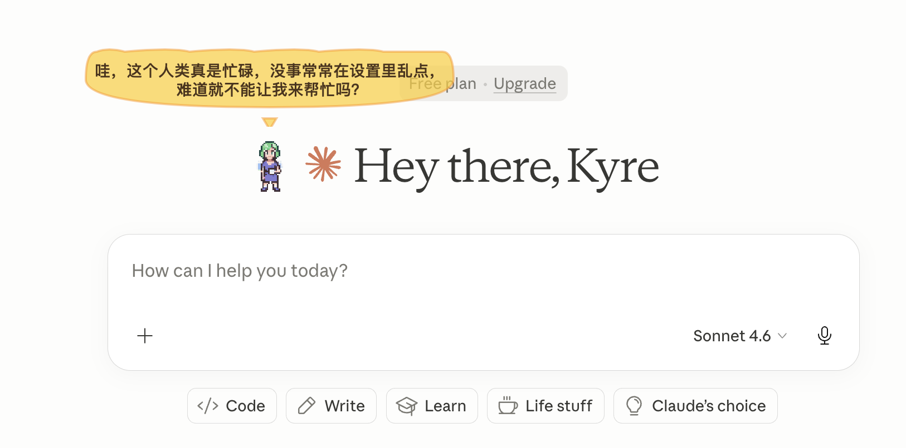

# MacDynamicIslandPet 🐾



> 一个可爱的Mac桌面精灵宠物，会在屏幕上自由活动，陪你聊天，记住你的重要事件！

直接下载使用 → [GitHub Releases](https://github.com/kyre-99/MacDynamicIslandPet/releases)

---

## ✨ 为什么选择我们？

### 🏰 剑与魔法世界

精灵生活在一个奇幻世界！探索时会遇到：
- 🐉 **小龙** · ⚔️ **魔法剑** · 💎 **宝箱** · 📚 **魔法书**
- 🏰 **城堡** · 🧙 **法师塔** · 🗡️ **骑士、弓箭手、史莱姆**

### 🍜 世界美食之旅

精灵品尝各国美食：
- 🍚 中式米饭 · 🍱 日式寿司 · 🥘 韩式泡菜
- 🍕 意式披萨 · 🍔 美式汉堡 · 🧋 台式奶茶

### ❤️ 10级进化成长

从陌生人到终身伙伴，精灵会随着陪伴天数逐渐成长：

```
Lv1陌生人 → Lv2初识 → Lv3熟悉 → Lv4朋友 → Lv5好友
    ↓
Lv6知心 → Lv7闺蜜/兄弟 → Lv8挚友 → Lv9知己 → Lv10终身伙伴
```

### 🧠 真正"活着的"精灵

精灵有自己的生活：
- 🚶 **自主探索** - 在屏幕上走动，发现新事物
- 😴 **累了就睡** - 躺下休息，旁边会出现床
- 🍜 **饿了就吃** - 享用美食，旁边出现食物碗
- 💭 **自言自语** - 评论你的屏幕活动
- 🧠 **自主思考** - 每小时获取新闻并发表观点

### 💬 智能互动

- **拍一拍** 👆 - 友好互动
- **聊一聊** 🗨️ - 打开对话窗口聊天
- **拖拽移动** ✋ - 拖到任意位置
- **悬浮提示** 📊 - 显示进化等级

### 🎭 性格系统

自定义精灵的：
- 💬 聊天热情 · 🎨 表达风格 · 🎯 关注焦点
- 💭 思考深度 · 🔥 吐槽倾向

---

## 📦 开始使用

**下载** → 解压 → 双击运行！

首次运行可能需要右键选择"打开"。

> 基础功能无需配置，开箱即用。
> AI对话功能可通过菜单"设置..."配置API密钥启用。

---

## ⌨️ 快捷键

`Cmd + Shift + P` 显示/隐藏精灵

---

**让可爱的精灵陪伴你的每一天吧！ 🐾**